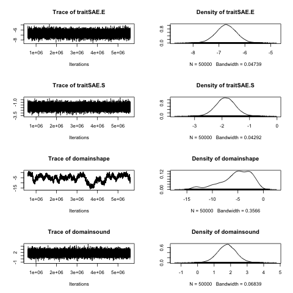
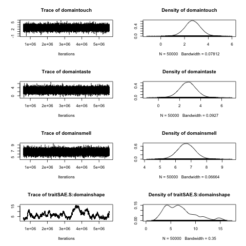
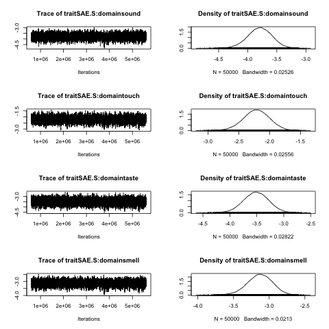
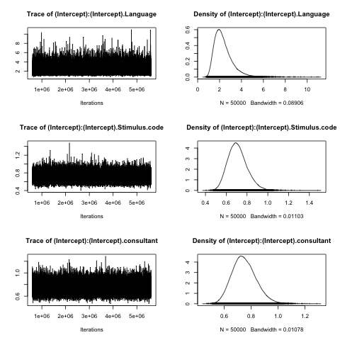
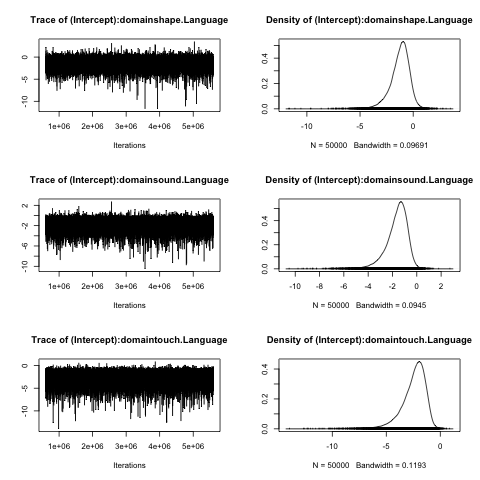
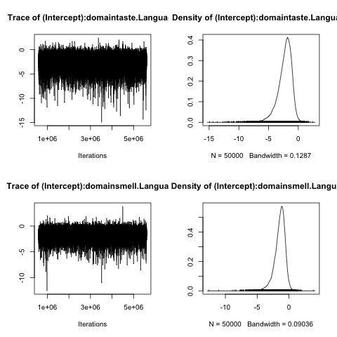

```{r eval=F, echo=F}
setwd("~/Documents/Bristol/Codability/LoP_Codability/analyses/")
```

# Load libraries

```{r message=F, error=F, warning=F}
library(party)
library(rpart.plot)
library(MCMCglmm)
library(RColorBrewer)
library(ggplot2)
library(scales)
library(reshape2)
library(lme4)
library(MuMIn)
library(dplyr)
```

# Load data

```{r}
# Load data
d = read.csv("../data/AllData_LoP.csv", stringsAsFactors = F)

# Get rid of non-responses
d = d[!is.na(d$head),]
d = d[!d$head %in% c("n/a","no description"),]
d = d[!is.na(d$SAE),]

d.all = d

```


# Are different kinds of responses more likely for different domains?

Different domains are more or less likely to use different types of description (look at first responses only):

```{r}
d = d[d$Response==1,]

d$SAE = as.factor(d$SAE)

#sae.order = names(sort(tapply(d$SAE,d$domain, function(X){sum(X=="A")/length(X)}),decreasing = T))
# Make colour baseline
sae.order = c("colour","shape","sound","touch","taste","smell")

d$domain = factor(d$domain, levels = sae.order)

tx = table(d$SAE,d$domain)
tx2 =melt(prop.table(tx,margin = 2))
tx2$Var1 = factor(tx2$Var1, levels = c("S","E","A"))

gx = ggplot(tx2,aes(x = Var2, y = value,fill = Var1)) + 
  geom_bar(position = "fill",stat = "identity") +
  scale_y_continuous(labels = percent_format()) +
  xlab("Domain") + ylab("Percentage of responses") +
  scale_fill_discrete(name = "Description type", 
                      breaks = c("E","S", "A"),
                      labels=c("Evaulative","Source-based","Abstract"))  

pdf("../results/graphs/SAE_RawProportions.pdf")
gx
dev.off()
gx
```

We can look for clusters using a simple decision tree (though this doesn't control for random effects):

```{r}
d2 = d
d2$domain = factor(d2$domain,
  levels=c("colour","shape","smell","sound","taste",'touch'),
  labels=c("C","Sh","Sm","So","Ta","To"))
d2$SAE = as.factor(d2$SAE)
rt.sae = ctree(SAE~
          domain,
         data = d2)
plot(rt.sae,
  terminal_panel=node_barplot(rt.sae,
  beside = F,id=F, ylines=1),
  ip_args=list(cex=0.5),
  inner_panel = node_inner(rt.sae,id=F))
```


```{r}
prop = d %>% group_by(Language,domain,SAE) %>%
  summarise (n = n()) %>%
  mutate(prop = n / sum(n))

res = data.frame(Language=NA,SAE=NA,shape=0,sound=0,touch=0,taste=0,smell=0)

for(lang in unique(prop$Language)){
  for(saex in c("S","A","E")){
    dx = prop[prop$Language==lang & prop$SAE==saex,]
    px = dx$prop[match(c("colour","shape",'sound','touch','taste','smell'),dx$domain)]
    px[is.na(px)] = 0
    res = rbind(res, 
                c(lang, saex, 
                  (px[2:6] - px[1]) # difference between colour and other domains
                  ))
  }
}
res = res[2:nrow(res),]
for(i in 3:7){
  res[,i] = as.numeric(res[,i])
}

res2 = melt(res, id=c("Language","SAE"))

res2$SAE = factor(res2$SAE,levels=c("S","E",'A'))

gx = ggplot(res2, 
            aes(x=Language, y=value, colour=SAE)) +
  geom_point() +
  coord_flip() +
  facet_grid(.~variable, scales = 'free_x') +
  xlab("Raw change in proportion compared to colour")

gx

```


## MCMCglmm 

Because there are three possible categories of response, a categorical model is needed.  In addition, there are multiple random effects in the design.  Therefore, we use the `MCMCglmm` package which can handle this situation.  The framework is similar to an `lme4` mixed effects model, except that estimation is done using a Monte Carlo Markov Chain which converges on a good fit over a number of iterations.

```{r echo=F}
# Output the data frame so we can run MCMC on the cluster, see run_full_SAE_MCMCglmm_model.R
save(d, file="../data/SAE_data_frame.rDat")
```

Set the random seed for replicability:

```{r}
set.seed(328)
```

(the code below is actually processed on a cluster computer, but shown here for posterity)

```{r mcmcglmm, eval=F}

k <- length(levels(d$SAE))
I <- diag(k-1)
J <- matrix(rep(1, (k-1)^2), c(k-1, k-1))

prior.m <- list(
  R = list(fix=1, V=0.5 * (I + J), n = 2),
  G=list(
        #Language
        G1=list(V =diag(1),n=1),  # set to 2 for RSlope 
        # Stimulus.code
        G2=list(V =diag(1),n=1),
        # consultant
        G3=list(V =diag(1),n=1)))

randomLang.model <- MCMCglmm(
  SAE ~ -1 + trait * domain,
  ~ us(1):Language + 
    us(1):Stimulus.code +
    us(1):consultant,
  data   = d,
  rcov = ~ us(trait):units,
  family = "categorical",
  prior  = prior.m,
  thin   =      10,
  burnin =   10000,
  nitt   =  110000,
  verbose = F)

save(m.mcmcglmm, file="../results/SAE_mcmc_model.rdat")
```

Model with no random effect for language:

```{r eval=F}
prior.m <- list(
  R = list(fix=1, V=0.5 * (I + J), n = 2),
  G=list(
    #Language
    #G1=list(V =diag(1),n=1),  
    # Stimulus.code
    G1=list(V =diag(1),n=1),
    # consultant
    G2=list(V =diag(1),n=1)))
m.mcmcglmm <- MCMCglmm(
  SAE ~ -1 + trait * domain,
  ~ us(1):Stimulus.code +
    us(1):consultant,
  data   = d,
  rcov = ~ us(trait):units,
  family = "categorical",
  prior  = prior.m,
  thin   =	10,
  burnin =   10000,
  nitt   =  510000,
  verbose = T)

save(m.mcmcglmm, file="../results/SAE_mcmc_model_full_long_noLanguage.rdat")
```

Model with interaction between langauge and domain (random slopes for domain by language):

```{r eval=F}
prior.m <- list(
  R = list(fix=1, V=0.5 * (I + J), n = 2),
  G=list(
    #Language
    G1=list(V =diag(6),n=6),  # One level for each domain
    # Stimulus.code
    G2=list(V =diag(1),n=1),
    # consultant
    G3=list(V =diag(1),n=1)))

m.mcmcglmm <- MCMCglmm(
  SAE ~ -1 + trait * domain,
  ~ us(1+domain):Language +
    us(1):Stimulus.code +
    us(1):consultant,
  data   = d,
  rcov = ~ us(trait):units,
  family = "categorical",
  prior  = prior.m,
  thin   =      100,
  burnin =   600000,
  nitt   =  5600000,
  verbose = T)
save(m.mcmcglmm, file="../results/SAE_mcmc_model_full_long_RSlope.rdat")
```


\newpage

## Compare models

We ran three models: With no random effect for language, with a random intercept for language and with a random slope for domain by language (interaction). 

Load the models:

```{r}
load("../results/SAE_mcmc_model_full.rdat")
randomLang.model = m.mcmcglmm
load("../results/SAE_mcmc_model_full_long_noLanguage.rdat")
noLang.model = m.mcmcglmm
load("../results/SAE_mcmc_model_full_long_RSlope_longBurnin_2.rdat")
interaction.model = m.mcmcglmm
```


```{r}
model.sel(randomLang.model,noLang.model,interaction.model, rank="DIC")
```

The model with a random slope for domain by language is the best.  It's a considerable jump in log likelihood.  However, looking at the fixed effects estimates, they are very similar between the model with and without random slopes for languages.  The main difference is for shape:

```{r}
interaction.model.coef = as.data.frame(summary(interaction.model)$solutions)
randomLang.model.coef = as.data.frame(summary(randomLang.model)$solutions)

plot(interaction.model.coef$post.mean, 
     randomLang.model.coef[rownames(interaction.model.coef),]$post.mean,
     xlim=c(-10,15), col=2, pch=16,
     xlab="Model with interaction between domain and langauge",
     ylab="Model with only language random effect")
text(interaction.model.coef$post.mean, 
     randomLang.model.coef[rownames(interaction.model.coef),]$post.mean,
      rownames(interaction.model.coef),
     pos=1)
abline(0,1)
```

Final model:

```{r}
final.model = interaction.model
```

Plot the model convergence traces (Render as png to save space):

```{r}
# Fixed effects:
for(i in seq(1,12,by=4)){
  png(paste0("../results/MCMCConvergence_",i,".png"))
  plot(final.model$Sol[,i:min((i+3),12)])
  dev.off()
}
# Some selected random slopes
c1 = c("(Intercept):(Intercept).Language",
  "(Intercept):(Intercept).Stimulus.code",
  "(Intercept):(Intercept).consultant")

c2a = c("(Intercept):domainshape.Language",
  "(Intercept):domainsound.Language",
  "(Intercept):domaintouch.Language")
c2b = c("(Intercept):domaintaste.Language",
  "(Intercept):domainsmell.Language")

png("../results/MCMCConvergence1.png")
plot(final.model$VCV[,c1])
dev.off()
png("../results/MCMCConvergence2a.png")
plot(final.model$VCV[,c2a])
dev.off()
png("../results/MCMCConvergence2b.png")
plot(final.model$VCV[,c2b])
dev.off()
```














\newpage


## Interpreting the results

```{r echo=F}
getMCMCglmmText = function(sx){
  p = sx$pMCMC
  if(p < 0.001){
    p = "< 0.001"
  } else{
    p = signif(p,3)
  }
  paste0(c(
    "beta = ", signif(sx$post.mean,3),
    "[",signif(sx$`l-95% CI`,3),",",
        signif(sx$`u-95% CI`,3),"] ",
    "p = ",p),
    collapse="")
}
```

Fixed effects estimates:

```{r}
sx.all = as.data.frame(summary(final.model)$solutions)
apply(sx.all,2,signif,digits=3)
```

```{r echo=F,eval=F}
#The results show that, overall, the probability of using abstract terms is higher than using source-based (`r getMCMCglmmText(sx.all[2,])`) and evaluative (`r getMCMCglmmText(sx.all[1,])`) terms.
```

The results show that, across the board, abstract descriptions are more likely than source-based descriptions, which are more likely than evaluative descriptions. Compared to the colour domains, other domains are more likely to use evaluative descriptions, except for shape which is more likely to use source-based descriptions.  The estimates for source-based descriptions of smell, sound, taste and touch are very similar, as are the estimates for evaluative descriptions for sound, taste and touch.  However, the estimate for evaluative descriptions for smell is much higher, suggesting that evaluative descriptions are more likely for the smell domain.

The graph below shows how the probaility of using Evaluative and Source-based descriptions differs from the baseline condition, which is the sound domain.  The vertical axis is in log probability, so above 0 means more likely and below zero means less likely.  If the 95% confidence intervals are different from 0, then there is a significant effect.  The difference in proportion of abstract responses for each domain (compared to colour) is implied by the difference between the evaluative and source-based, and is plotted for ease of reference, but no confidence intervals are given.

See the file [results/SAE_interpretation.pdf](https://github.com/seannyD/LoP_Codability_Public/blob/master/results/SAE_interpretation.pdf) for a fuller explanation of the results.

Note that the effective sample size (eff.samp) for two of the parameters is very low (< 100).  These results come from increasing the number of iterations by an order of magnitude compared to the other models (to roughly two weeks processing time on a cluster computer).  These increases made little difference to the effective sample size, but did make the estimate distributions less bimodal. It is likely that a different prior would help.  However, the estimates are still significant, the outlying estimates suggest a greater effect size (not closer to zero) and the model fits the data well.  We suggest that the differences are still significant.  Also note that the model selection test preferred the interaction model even when all models were run for the same number of iterations.

```{r}
plotModelEstimates = function(sx,ylab){

  sx$var = rownames(sx)
  sx = sx[grepl("domain",sx$var),]
  sx$grp = "Evaluative"
  sx$grp[grepl("traitSAE\\.S",sx$var)] = "Source-based"
  
  sx$domain = gsub("domain","",sx$var)
  sx$domain = gsub("traitSAE\\.S\\:","",sx$domain)
  
  sx$var = substr(sx$var, 7,nchar(sx$var))
  sx$var = factor(sx$var,levels = sae.order)
  names(sx)[names(sx)=="l-95% CI"] = 'lower'
  names(sx)[names(sx)=="u-95% CI"] = 'upper'
  
  # add logical estimate of change for abstract
  sx = rbind(sx,
    data.frame(
      post.mean = -(sx[1:5,1] + sx[6:10,1]),
      lower = rep(NA,5),
      upper = rep(NA,5),
      eff.samp = rep(NA,5),
      pMCMC = rep(NA,5),
      var = sx[1:5,]$var,
      grp = rep("Abstract",5),
      domain = sx[1:5,]$var
  ))
  
  gx = ggplot(sx, aes(y=post.mean,x=domain, colour=grp)) + 
    geom_hline(yintercept=0, color="black", size=1) +
    geom_point(size=3, position = position_dodge(width = 0.25)) +
    geom_errorbar(aes(ymax=upper, 
                      ymin=lower),width=0.2,
                  position = position_dodge(width=0.25))+
    xlab("Domain")+
    ylab(ylab) +
    scale_color_manual(values=c("#619CFF", "#00BA38", "#F8766D"),name = "Description type") 
  return(gx)
}

gx = plotModelEstimates(sx.all,"Difference from colour domain")
gx
pdf("../results/graphs/SAE_Results.pdf", height = 5)
gx
dev.off()
```


\newpage

## SAE model with alternative intercept

A model where the intercept is taste gives equivalent results:

```{r}
load("../results/SAE_mcmc_model_full_long_InterceptIsTaste.rdat")
taste.model = m.mcmcglmm
gx.taste = plotModelEstimates(as.data.frame(summary(taste.model)$solutions),
                              "Difference from taste domain")
gx.taste
pdf("../results/graphs/SAE_Results_InterceptIsTaste.pdf", height = 5)
gx.taste
dev.off()
```

\newpage

# Test differences between modalities


Are signed languages more likely to use particular types of response?  Use a mixed effects model, predicting likelihood of an abstract response, with random effects for language, consultant, domain, stimulus and the interaction between language and domain.  Then add a random effect for modality by domain, and a fixed effect of modality

```{r cache=T}
d$modality = "Spoken"
d$modality[d$Language %in% c("ASL", "BSL", "Kata Kolok")] = "Signed"
d$modality = factor(d$modality, levels=c("Spoken",'Signed'))
dSignTest = d[d$domain!='sound',]
dSignTest$domain = factor(dSignTest$domain)
dSignTest$Language = factor(dSignTest$Language)
dSignTest$Stimulus.code = factor(dSignTest$Stimulus.code)
dSignTest$consultant = factor(dSignTest$consultant)
dSignTest = dSignTest[complete.cases(dSignTest[,c("Language",'domain','SAE','consultant','Stimulus.code')]),]
dSignTest$Abstract = dSignTest$SAE == "A"
m0 = glmer(Abstract ~ 
             1 +
             (1|Language/consultant) + 
             (1|domain/Stimulus.code) +
             (1|Language:domain),
           data = dSignTest,
           family = binomial)
m1 = update(m0,~.+(0 + modality|domain))
m2 = update(m1,~.+modality)
anova(m0,m1,m2)
```

Neither the fixed effect of modality nor the random effect of modality by domain improves the model.  That is, signed languages are not a distinct group.

\newpage

# Test if abstract responses are less likely in later descriptions.

Respondents could produce multiple responses.  In conversational interaction, participants tend to move towards more specific information when converging on a referent of a description (Dingemanse et al., 2015).  Abstract responses are proportionately less likely in later descriptions:

```{r}
d = d.all # switch back to all responses
# Recode categories to plot
d$Response.cat = "1"
d[d$Response==2,]$Response.cat = "2"
d[d$Response==3,]$Response.cat = "3"
d[d$Response==4,]$Response.cat = "4"
d[d$Response>4,]$Response.cat = "5+"

txR = melt(prop.table(table(d$SAE,d$Response.cat),2))

ggplot(txR,aes(x = Var2, y = value,fill = Var1)) + 
  geom_bar(position = "fill",stat = "identity") +
  scale_y_continuous(labels = percent_format()) +
  xlab("Response Number") + ylab("Percentage of responses")

```

We test whether the probability of using an abstract description varies according to the number of times that stimuli had been named by the respondent previously.  Response numbers range from 1 to `r max(d$Response)`, but 99% are 5 or lower.  We set all response numbers of 5 or more to be equal to 5.  We used a linear mixed effects model with random intercepts for respondent within languages and stimuli within domains, with a random slope for response number by domain.

We compare a model with random intercepts for consultants within languages and stimuli within domain. Then a third model adds the main effect for response number. 

```{r respLME, cache=T}

logit2prob=function(X){
	exp(X)/(1+exp(X))
}

d$SAE.abstract = d$SAE=="A"
d$Response2 = d$Response
d$Response2[d$Response>5]=5
d$Response2 = d$Response2-1

m0 = glmer(SAE.abstract~ 1 +
             (1|Language/consultant) +
             (1|domain/Stimulus.code),
           data = d,
           family='binomial')

mR = glmer(SAE.abstract~ 1 +
       (1|Language/consultant) +
       (1|domain/Stimulus.code) +
       (0+Response2|domain),
       data = d,
       family='binomial')

mRD = glmer(SAE.abstract~ Response2 +
       (1|Language/consultant) +
       (1|domain/Stimulus.code) +
       (0+Response2|domain),
       data = d,
       family='binomial')

ax = anova(m0,mR,mRD)
ax
summary(mRD)

# estimated probability at first response:
pA.R1 = logit2prob(fixef(mRD)[1])
# probability decrease with each response:
pA.Rplus = pA.R1 - logit2prob(sum(fixef(mRD)))

#The probability of producing an abstract response in the first turn is 
round(pA.R1*100,1)
# % .  This decreases by 
round(pA.Rplus*100,1)
#percentage points after each response.

```

Random slopes for response number by domain significantly improve the fit of the model.  Abstract descriptions are not less likely in later descriptions when controlling for this random slope.  That is, the effect is stronger for some domains:

```{r}
rint = fixef(mRD)[1] + ranef(mRD)$domain[,1]
rslope = fixef(mRD)[2] + ranef(mRD)$domain[,1]

xpoints = seq(1,5,length.out=100)

dx = data.frame(
  y=as.vector(sapply(xpoints,function(X){rint + (rslope*X)})),
  x=rep(xpoints,each=6),
  Domain=rep(levels(factor(d$domain)), 100))

dx$y = logit2prob(dx$y)

dx$Domain = factor(dx$Domain, levels=c("shape","sound",'smell',"touch",'colour','taste'))

ggplot(dx, aes(x=x,y=y,colour=Domain)) +
  geom_line() +
  xlab("Response number") +
  ylab("Probability of abstract description")
```

## Summary

We found that they were less likely to use abstract descriptions for later responses (proportion of abstract terms in first description = 72%, in second description = 58%), but this was mainly driven by responses to taste and colour (random slope for response number by domain p<.001).  The probability of producing an abstract description for taste drops from 47% to 9% over 5 responses.

